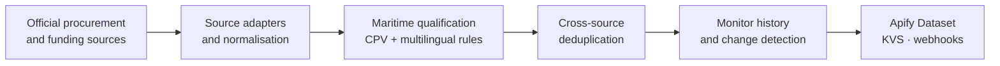

# EU Maritime & Port Opportunity Monitor

### Monitor Europeo de Oportunidades Marítimas y Portuarias

> Procurement intelligence for companies working in ports, maritime construction and coastal infrastructure.

**Private source · Public showcase · Work in progress**

The EU Maritime & Port Opportunity Monitor is an Apify Actor for companies that need to find and follow
public procurement opportunities before they disappear into an unfiltered notice feed. It focuses on
ports, dredging, coastal works, terminals, shore power and related maritime engineering services.

The source project remains private. This repository is the public window into the product: it explains
the problem, the signal model and the intended workflow without publishing implementation code, private
test data or deployment configuration.

**[View the live Actor on Apify →](https://apify.com/dekaz/eu-maritime-port-opportunity-monitor)**

## What it monitors

- port, harbour, quay, berth, jetty, breakwater and terminal works;
- dredging, reclamation and coastal-protection projects;
- mooring, fendering, navigation and port-safety systems;
- shore-side electricity, alternative fuels and port decarbonisation;
- maritime engineering, geotechnical and environmental services.

## Who it is for

The Actor is designed for marine contractors, engineering consultancies, dredging and coastal-works
specialists, port-equipment suppliers, shore-power providers, terminal operators and business-development
teams preparing bids in Spain and the European Union.

It is procurement intelligence for companies. It is not a jobs, vacancies, candidates or employment
scraper.

## What makes the signal useful

The monitor combines official procurement and funding signals with a deterministic maritime taxonomy:

1. official notices are normalised into a common opportunity model;
2. CPV roots, Spanish and English technical terminology and buyer signals qualify the notice;
3. related records from different sources are deduplicated;
4. a stable monitor profile compares each scan with its previous state;
5. the Actor emits only meaningful lifecycle events such as `NEW`, `UPDATED`, `AWARDED` or `CANCELLED`.

Every qualified result carries the matched rules and official source links. The product does not use an
LLM or an opaque probability-of-winning score in its first version.

## Official signal families

- **PLACSP** — Spanish preliminary consultations, tenders, awards and cancellations.
- **TED** — European procurement notices and awards.
- **EU Funding & Tenders** — calls and funded-project signals that may precede procurement.

The public documentation points to the official interfaces; it does not copy notices, tender documents
or private customer data.

## Architecture at a glance

The [architecture note](docs/ARCHITECTURE.md) describes the public product boundary. The [roadmap](docs/ROADMAP.md)
describes the current direction without exposing private implementation details.

## Current boundary

This showcase does not contain:

- the private Actor source code, Docker files or deployment configuration;
- credentials, deploy keys or private Apify settings;
- copied tender documents, client data or proprietary datasets;
- PDF interpretation, bid recommendations or probability estimates.

Examples and future screenshots will use synthetic or deliberately anonymised data. Official values
remain attributable to their source and should be verified before bidding.

## About this repository

This is a documentation-first showcase. The private source repository is the system of record; this
repository is synchronised from a reviewed public subset by GitHub Actions. See [NOTICE.md](NOTICE.md)
for the publication boundary.

## En español

EU Maritime & Port Opportunity Monitor es un Actor de Apify para empresas que buscan licitaciones y
señales tempranas de contratación pública en puertos, dragados, obras marítimas, protección costera,
terminales y descarbonización.

No es un extractor de empleo. El código fuente permanece privado; este repositorio solo documenta el
producto, su alcance y su evolución pública.

**[Ver el Actor en Apify →](https://apify.com/dekaz/eu-maritime-port-opportunity-monitor)**
