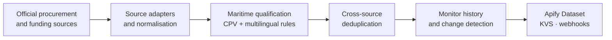

# EU Maritime & Port Opportunity Monitor

> Procurement intelligence for ports, maritime construction and coastal infrastructure.

**Product documentation · Active development**


EU Maritime & Port Opportunity Monitor is an Apify Actor that turns official Spanish and European
procurement signals into qualified lifecycle events. It helps contractors, engineering consultancies,
equipment suppliers and business-development teams follow relevant opportunities without reading an
unfiltered notice feed.

## What it monitors

- port, harbour, quay, berth, jetty, breakwater and terminal works;
- dredging, reclamation and coastal-protection projects;
- mooring, fendering, navigation and port-safety systems;
- shore-side electricity, alternative fuels and port decarbonisation;
- maritime engineering, geotechnical and environmental services.

This is procurement intelligence for companies. It is not a jobs, vacancies, candidates or employment
scraper.

## How the signal works

1. Official notices are normalised into a common opportunity model.
2. Maritime CPV roots, Spanish and English terminology and buyer signals qualify each notice.
3. Related records from different sources are deduplicated.
4. A stable monitor profile compares every successful scan with its previous state.
5. The Actor emits meaningful lifecycle events such as `NEW`, `UPDATED`, `AWARDED` or `CANCELLED`.

Every qualified result carries the matched rules and official source links. The first version uses
deterministic classification rather than an LLM or an opaque probability-of-winning score.

## Official sources

- **[PLACSP Open Data](https://contrataciondelestado.es/wps/portal/DatosAbiertos)** — Spanish
  preliminary consultations, tenders, awards and cancellations.
- **[TED Search API](https://docs.ted.europa.eu/api/latest/search.html)** — European procurement
  notices and awards.
- **[EU Funding & Tenders APIs](https://ec.europa.eu/info/funding-tenders/opportunities/portal/screen/support/apis)** —
  calls and funded-project signals that may precede procurement.

The monitor points back to these official interfaces. It does not republish tender documents or
customer data.

## Example event

The following record is synthetic and illustrates the public output shape; it is not a real notice:

```json
{
  "eventType": "NEW",
  "opportunityId": "ted:synthetic-001",
  "title": "Shore-side electricity installation at a port",
  "phase": "OPEN",
  "source": "ted",
  "matchedRules": ["cpv:45241000", "keyword:shore power"],
  "sourceUrl": "https://ted.europa.eu/"
}
```

## Architecture at a glance



The [architecture note](docs/ARCHITECTURE.md) describes the public product boundary. The
[roadmap](docs/ROADMAP.md) records the current direction without exposing implementation details.

## Public boundary

This repository does not contain source code, credentials, deployment settings, customer information,
proprietary datasets or copied tender documents. It also excludes PDF interpretation, bid
recommendations and probability estimates. Official values must be verified before bidding.

## En español

EU Maritime & Port Opportunity Monitor localiza y sigue señales oficiales de contratación pública en
puertos, dragados, obras marítimas, protección costera, terminales y descarbonización. Clasifica cada
oportunidad mediante reglas trazables y conserva los enlaces a la fuente oficial.

## About this repository

This repository is the reviewed public presentation layer. Publication is synchronised by GitHub
Actions running from the private source repository; this public tree intentionally contains no
publication workflow. See [NOTICE.md](NOTICE.md) for the publication boundary.
