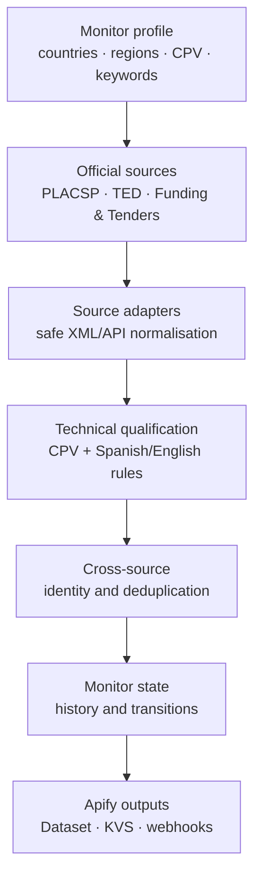

# Public architecture view

This page describes the product boundary without publishing implementation details.

## Design goals

### Official, traceable signals

Each opportunity remains linked to the official notice, award or funding record that produced it.
The monitor is intended to shorten discovery time, not to replace verification of the source notice.

### Deterministic qualification

The first version combines maritime CPV families, Spanish and English technical terms and authority
signals. Matched rules are returned with each result so that the qualification can be inspected and
adjusted by the user.

### Stable history

A `monitorId` identifies a commercial monitoring profile. Reusing it lets the Actor compare a new scan
with the last successful observation and emit meaningful lifecycle changes without billing the same
event twice.

### Private implementation, public communication

The public repository documents the product shape and operating boundary. The implementation, fixtures,
private tests and deployment details remain in the private repository.

## Technology direction

- Runtime: Python Actor on Apify.
- Integrations: official public interfaces for Spanish and European procurement and funding.
- Output model: traceable opportunity events with source evidence and change metadata.
- First release: API-first, deterministic and without LLM enrichment or PDF interpretation.
